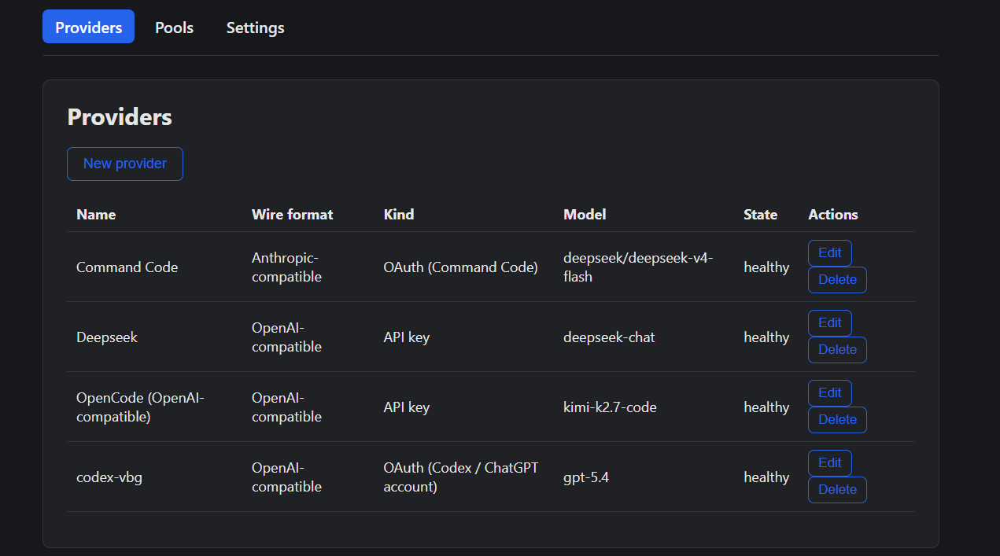

# 1router

Your own LLM API gateway. Point Claude Code, Cursor, OpenCode, or any
OpenAI/Anthropic-compatible tool at one URL, and 1router routes each
request to whichever provider you've configured — OpenAI, Anthropic,
DeepSeek, OpenCode, Gemini, a ChatGPT account, or a Command Code account.
One binary, one local database file, no external services to run.

## Install

**Prebuilt binary** (recommended) — grab the latest from the
[Releases page](https://github.com/ducphamhoang/1router/releases/latest):

```
curl -LO https://github.com/ducphamhoang/1router/releases/latest/download/1router-<version>-<target>.tar.gz
tar -xzf 1router-<version>-<target>.tar.gz
```

`<target>` is one of `x86_64-unknown-linux-musl`, `aarch64-unknown-linux-musl`,
`x86_64-apple-darwin`, `aarch64-apple-darwin` — match your OS/CPU. `<version>`
is the version shown on the Releases page (e.g. `v0.3.4`).

**Docker**:

```
mkdir -p data
docker run -it --rm -p 8080:8080 -v "$PWD/data:/data" \
  -e ROUTER_SQLITE_PATH=/data/1router.db ghcr.io/ducphamhoang/1router:latest setup
docker run -d --name 1router -p 8080:8080 -v "$PWD/data:/data" \
  -e ROUTER_SQLITE_PATH=/data/1router.db ghcr.io/ducphamhoang/1router:latest
```

**From source** (needs Rust + Node.js):

```
cargo build --release
```

## Set up

Run the interactive wizard once:

```
./1router setup
```

**The admin secret and admin UI password are not prompted for.** A
brand-new install uses fixed, published defaults so you land on provider
setup immediately:

- Admin UI password: **`password`** (username: `admin`)
- Shared secret (for `Authorization: Bearer <secret>` on `/v1/*` and
  `/admin/*`): **`1router-api-key`**

These are meant to get you to "make a real request" in under a minute on a
local/dev box — they are **not** meant to be exposed beyond localhost as-is.
Every time 1router starts with either default still in place, it logs a
warning; the admin UI also shows a banner on every page until you change
them. Change either anytime via:

- `./1router setup --reset-admin-password` (admin UI password), or the
  Settings page in the admin UI.
- `PATCH /admin/settings/shared-secret` (see
  [`docs/ARCHITECTURE.md`](docs/ARCHITECTURE.md)), or the Settings page.
- Setting `ROUTER_SHARED_SECRET` yourself before first boot, if you'd
  rather never touch the default at all.

After that, the wizard walks you through:

1. **Adding a provider** — pick a template first (it pre-fills a
   suggested id/name plus the fields below - press Enter to accept
   everything, or edit any field): **OpenAI**, **Anthropic**, **DeepSeek**,
   **OpenCode**, or **Gemini** — paste an API key (OpenCode has a free tier
   that needs no key at all; Gemini uses Google's own OpenAI-compatible
   endpoint, so no wire-format translation is needed). **ChatGPT account
   (Codex)** or **Command Code** log in through your browser instead, no
   API key needed. **Custom** (an unlisted provider) is last in the list —
   pick it if none of the templates fit.
2. **Making it callable** — the wizard reports the provider's direct
   `<provider-id>/<model>` name, which is immediately usable as a `model`
   value. Optionally add it to a pool later for round-robin/failover.

Adding a second provider of the same template (e.g. a second OpenAI key)
suggests a name that doesn't collide with the first one (`openai-2`,
`openai-3`, ...) instead of asking you to invent one.

Here's a real run, picking OpenCode's free tier (no API key needed —
just press Enter to accept the pre-filled one):

```
$ ./1router setup

=== 1router setup ===

Admin secret: no secret file yet - using the default '1router-api-key' (documented in README.md) so you can get straight to provider setup. Written to ".router_secret" (mode 0600).
  Use it as `Authorization: Bearer 1router-api-key` on /v1/* and /admin/*. Change it anytime via `PATCH /admin/settings/shared-secret`, the admin UI Settings page, or by setting ROUTER_SHARED_SECRET before first boot.
✔ Add a provider now? · yes
✔ Provider kind · passthrough (OpenAI/Anthropic-compatible API key)
✔ Template (pre-fills the fields below; all stay editable) · OpenCode Free
✔ Provider name (also used as its id) · opencode-free
✔ Wire format · openai
  note: base_url is POSTed as-is - include the full upstream path, e.g. https://api.openai.com/v1/chat/completions
✔ Upstream base_url (full path) · https://opencode.ai/zen/v1/chat/completions
  note: this template uses a public, non-secret key ('public') - press Enter to accept it, or type your own
✔ API key (input hidden) · ********
✔ Upstream model (the real model name this provider expects) · deepseek-v4-flash-free
  created provider 'opencode-free'
  added 'opencode-free' — call it as model 'opencode-free/deepseek-v4-flash-free' (or add it to a pool from the Pools menu)
✔ Add another provider? · no

Setup complete. Example request:

  curl http://<host>:<port>/v1/chat/completions \
    -H 'Authorization: Bearer <your-admin-secret>' \
    -H 'Content-Type: application/json' \
    -d '{"model":"<pool-id> or <provider-id>/<model>","messages":[{"role":"user","content":"hi"}]}'
```

Then start the server:

```
./1router
```

The same wizard also runs automatically the first time you start 1router
with an empty database.

### Client API access mode

The `/v1/*` client API can require the shared secret or run in **open access**
mode. Set the positive-polarity environment variable
`ROUTER_REQUIRE_SHARED_SECRET` to `true`, `false`, `1`, `0`, `yes`, or `no`
(case-insensitive); an invalid value stops startup. The environment variable
overrides the database setting and prevents changing it from the admin UI.

On a fresh install that has never resolved a shared secret, the mode defaults
to open and is saved in the existing `server_secrets` table. An installation
that already had a shared secret in `ROUTER_SHARED_SECRET` or `.router_secret`
defaults to requiring the key, preserving its pre-upgrade behavior. Change
the mode from `1router setup` or the Settings page. Open access affects
`/v1/*` only: `/admin/*` still requires its session/password or a valid shared
secret Bearer token.

Because `ROUTER_LISTEN_ADDR` defaults to `0.0.0.0:8080`, open access on the
default bind is reachable from other machines. 1router logs a warning on every
boot in that case; bind to `127.0.0.1:8080` or set
`ROUTER_REQUIRE_SHARED_SECRET=true` to remove the exposure. Open access does
not add rate limiting or any other protection against request volume; it only
removes the client API-key requirement.

## Try it

```
curl http://localhost:8080/v1/chat/completions \
  -H "Authorization: Bearer $(cat .router_secret)" \
  -H 'Content-Type: application/json' \
  -d '{"model":"<provider-id>/<model>","messages":[{"role":"user","content":"hi"}]}'
```

Replace `<provider-id>/<model>` with a provider you added — e.g.
`opencode-free/deepseek-v4-flash-free` — or with a pool id if you've created
one on the Pools page. `GET /v1/models` lists every callable model id.

Vision (image) input is supported end-to-end. Send an OpenAI-style
`image_url` part on `/v1/chat/completions`, or an Anthropic-style
`image` + `source` block on `/v1/messages` — the router translates between
the two shapes as needed, so the command-code branch accepts both and
forwards a valid request to the model:

```
curl http://localhost:8080/v1/chat/completions \
  -H "Authorization: Bearer $(cat .router_secret)" \
  -H 'Content-Type: application/json' \
  -d '{"model":"command-code/Qwen/Qwen3.7-Flash","messages":[{"role":"user","content":[{"type":"text","text":"What is in this image?"},{"type":"image_url","image_url":{"url":"data:image/png;base64,<base64-data>"}}]}]}'
```

## Admin dashboard

Open `http://localhost:8080/ui/` and log in as `admin` with the password
from setup (`password`, unless you've changed it — see
[Set up](#set-up)).

While either the default admin password or the default shared secret is
still in place, every page shows a banner reminding you to change it (see
[Set up](#set-up) for how).

Scripting that same login instead of using the UI? `POST /admin/auth/login`
also needs an `X-Requested-With: 1router-ui` header on top of the JSON
body — it's the same CSRF guard that protects every other non-GET
`/admin/*` request made with the session cookie, and login is the one place
you can't yet be holding that cookie:

```
curl -i -X POST http://localhost:8080/admin/auth/login \
  -H 'Content-Type: application/json' \
  -H 'X-Requested-With: 1router-ui' \
  -d '{"username":"admin","password":"password"}' \
  -c cookies.txt
```

That header requirement only applies to this cookie-based login flow. If
you're scripting the rest of the admin API instead (as in
[Learn more](#learn-more)), skip the login dance entirely and send
`Authorization: Bearer <shared-secret>` on each request — that path is
exempt from the CSRF check.

**Providers** — add, edit, or remove providers. Picking a template
pre-fills a suggested id/name (deduped against providers you already have,
so a second same-template provider suggests `-2`, `-3`, ...) plus the wire
format, base URL, and a starting model, so you don't need to look up API
details yourself. "Custom" is last in the template list. Each provider also
has an opt-in "Log requests/responses" checkbox (off by default) for
[dataset logging](docs/ARCHITECTURE.md#dataset-logging) — captures raw
request/response bodies as JSONL for later fine-tuning/distillation work.




**Pools** — group providers under one name for round-robin/failover, or
serve several models from one credential. Each pool membership can
individually override its provider's dataset-logging setting.


**Settings** — everything needed to connect a client (base URL, secret,
copy-pasteable curl example), plus a button to check which models each
provider actually offers right now.


*(The Pools/Settings screenshots aren't included yet — see
[`docs/screenshots/README.md`](docs/screenshots/README.md) if you'd like
to add them.)*

## Forgot your admin password?

```
./1router setup --reset-admin-password
```

(This is also how you change it away from the default `password` — there's
no "old password" prompt, since anyone who can run this CLI already has
filesystem access to the database.)

For headless deployments (Docker, systemd), set `ROUTER_SHARED_SECRET`
yourself instead of relying on the interactive wizard — see
[`docs/ARCHITECTURE.md`](docs/ARCHITECTURE.md#configuration-environment-variables)
for the full list of environment variables.

## Learn more

- [`docs/ARCHITECTURE.md`](docs/ARCHITECTURE.md) — configuration reference,
  wire-format translation rules, the admin API, and how a request flows
  through the system
- [`CLAUDE.md`](CLAUDE.md) — building from source, running tests,
  contributor conventions
